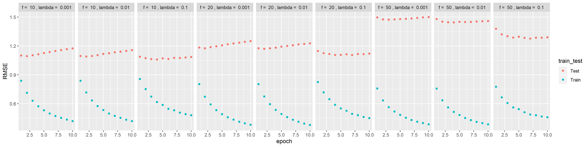
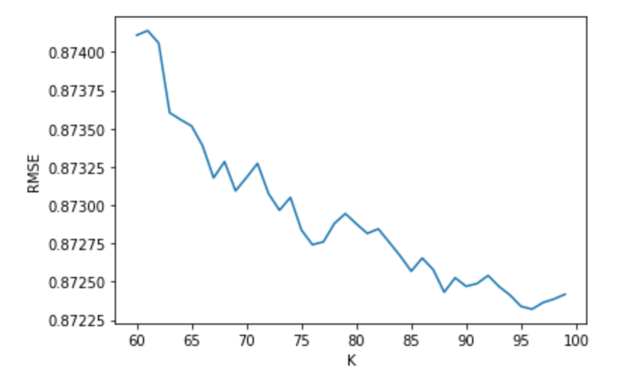

In this project, you are going to explore matrix factorization methods for recommender system. The goal is to match consumers with most appropriate products. Matrix factorization methods characterize both items and users by vectors of factors inferred from item rating patterns. High correspondence between item and user factors leads to a recommendation. Matrix factorization generally has 3 parts:

- factorization algorithm

- regularization

- postpocessing

It is highly recommended to read this [review paper](./paper/P1 Recommender-Systems.pdf).

### Step 1 Load Data and Train-test Split
```{r message=FALSE}
library(dplyr)
library(tidyr)
library(ggplot2)
library(anytime)
library(ggplot2)
data <- read.csv("../data/ml-latest-small/ratings.csv")
set.seed(0)

bins <- function(nbin, data=data){
  data$time <- anytime(data$timestamp) %>% format("%Y/%m/%d")
  time <- unique(data$time) %>% sort()
  bin_size <- round(length(time)/nbin)
  bin_label <- rep(1:nbin, each=bin_size)
  bin_label <- bin_label[1:length(time)]
  time_label <- data.frame(time, bin_label)
  time_label[is.na(time_label)] <- nbin
  bin <- merge(data, time_label, by="time") %>% select(-time)
  return(bin)
}

data_bins <- bins(30, data=data) 


test_idx <- sample(1:nrow(data), round(nrow(data)/5, 0))
train_idx <- setdiff(1:nrow(data), test_idx)
data_train <- data_bins[train_idx,]
data_test <- data_bins[test_idx,]
```

### Step 2 Matrix Factorization

#### Step 2.1 Algorithm and Regularization

- For algorithms, the referenced paper are:

A1. [Stochastic Gradient Descent](./paper/P1 Recommender-Systems.pdf) Section: Learning Algorithms-Stochastic Gradient Descent

- For regularizations, the referenced paper are:

R3. [Temporal Dynamics](./paper/P5 Collaborative Filtering with Temporal Dynamics.pdf) Section 4


```{r}
U <- length(unique(data_bins$userId))
I <- length(unique(data_bins$movieId))
source("../lib/Matrix_Factorization.R")
```


#### Step 2.2 Parameter Tuning

Here you should tune parameters, such as the dimension of factor and the penalty parameter $\lambda$ by cross-validation.

```{r}
source("../lib/cross_validation.R")
f_list <- c(10, 20, 50)
l_list <- seq(-3,-1,1)
f_l <- expand.grid(f_list, l_list)
```

```{r, eval=FALSE}
result_summary <- array(NA, dim = c(4, 10, nrow(f_l))) 
run_time <- system.time(for(i in 1:nrow(f_l)){
    par <- paste("f = ", f_l[i,1], ", lambda = ", 10^f_l[i,2])
    cat(par, "\n")
    current_result <- cv.function(data_bins, K = 3, f = f_l[i,1], lambda = 10^f_l[i,2])
    result_summary[,,i] <- matrix(unlist(current_result), ncol = 10, byrow = T) 
    print(result_summary)
  
})

save(result_summary, file = "../output/rmse.Rdata")
```

```{r}
load("../output/rmse.Rdata")
rmse <- data.frame(rbind(t(result_summary[1,,]), t(result_summary[2,,])), 
                   train_test = rep(c("Train", "Test"), each = 9), 
                   par = rep(paste("f = ", f_l[,1], ", lambda = ", 10^f_l[,2]), times = 2)) %>%           gather("epoch", "RMSE", -train_test, -par)
rmse$epoch <- as.numeric(gsub("X", "", rmse$epoch))
cv.result <- ggplot(rmse, aes(x = epoch, y = RMSE, col = train_test)) + geom_point() + 
  facet_grid(~par)
ggsave(plot=cv.result, filename = "cv_result.jpg",height = 100, width = 400, units="mm")
```



```{r}
load(file = "../output/mat_fac.RData")

RMSE <- data.frame(epochs = seq(10, 100, 10), 
                   Training_MSE = result$train_RMSE, 
                   Test_MSE = result$test_RMSE) %>% 
  gather(key = train_or_test, value = RMSE, -epochs)

ggplot(RMSE, aes(x = epochs, y = RMSE,col = train_or_test)) + 
  geom_point() + scale_x_discrete(limits = seq(10, 100, 10)) + 
  xlim(c(0, 100)) + 
  ggtitle("RMSE (f=10, lambda=0.1)")
```

### Step 3 Postprocessing
After matrix factorization, postporcessing will be performed to improve accuracy.
The referenced papers are:

P2:[Postprocessing SVD with KNN](./paper/P2 Improving regularized singular value decomposition for collaborative filtering .pdf) Section 3.5

P3:[Postprocessing SVD with kernel ridge regression](./paper/P2 Improving regularized singular value decomposition for collaborative filtering .pdf) Section 3.6

```{r, eval= FALSE}
result <- gradesc(f = 10, lambda = 0.1,lrate = 0.01, max.iter = 100, stopping.deriv = 0.01,
                   data = data_bins, train = data_train, test = data_test)

save(result, file = "../output/mat_fac.RData")
write.csv(result$p, file = "../output/p.csv")
write.csv(result$q, file = "../output/q.csv")
write.csv(result$b_user, file = "../output/b_user.csv")
write.csv(result$b_movie, file = "../output/b_movie.csv")
write.csv(result$b_bin, file = "../output/b_bin.csv")
write.csv(result$mu, file = "../output/mu.csv")

```

#### Postprocessing SVD with KNN

```{python, eval=FALSE}
# import neccessary library

from sklearn.neighbors import KNeighborsRegressor
from sklearn.model_selection import GridSearchCV
from sklearn.linear_model import LinearRegression
import pandas as pd
import numpy as np
import matplotlib.pyplot as plt
from itertools import chain
import math
import nbconvert

```

```{python, eval=FALSE}
# import dataset
q = pd.read_csv('../output/q.csv')
q.drop(['Unnamed: 0'], axis = 1, inplace=True)

# convert dataframe into a matrix
q_mat = q.to_numpy()
q_mat = np.transpose(q_mat)

# calculate mean rating for each movie
rating = pd.read_csv('../data/ml-latest-small/ratings.csv')
rating = rating[['movieId','rating']]
y = rating.groupby(['movieId']).mean()

````

Next, we will use Grid search cross validation to choose the optimal K

```{python, eval =FALSE}
# create a KNN regression model
knn_model = KNeighborsRegressor(metric = 'cosine', algorithm='brute')

# define parameters
param_grid = {'n_neighbors': np.arange(60, 100)}

# create grid search CV
knn_gscv = GridSearchCV(knn_model, param_grid, cv=5, scoring = 'neg_mean_squared_error')

# fit to our data
knn_gscv.fit(q_mat, y)

# the best knn parameter
knn_gscv.best_params_

# RMSE of our KNN model
math.sqrt(-1*knn_gscv.best_score_)
```

After searching, we found that when K=96, it will give us the smallest RMSE, which is $0.872$. We want to visualize the result of cross validation.

```{python, eval=FALSE}
# get RMSE for each K 
all_rmse = np.sqrt(-1*knn_gscv.cv_results_['mean_test_score'])
k = range(60,100)

# visualize RMSE w.r.t K
plt.plot(k, all_rmse)
plt.xlabel('K')
plt.ylabel('RMSE')

```



We see that RMSE is the smallest when $K=96$.

Now we want to combine all the component we had so far, including $p_i^Tq_i$, $b_i$, $b_u$, $b_{i,Bin(t)}$, and $KNN$, to construct a linear regression function to make predictions for the ratings.

```{python, eval=FALSE}
# import data
p = pd.read_csv('../output/p.csv')
b_user = pd.read_csv('../output/b_user.csv')
b_movie = pd.read_csv('../output/b_movie.csv')
mu = pd.read_csv('../output/mu.csv')
b_bin = pd.read_csv('../output/b_bin.csv')

# clean data
p.drop(['Unnamed: 0'], axis = 1, inplace=True)
b_user.drop(['Unnamed: 0'], axis = 1, inplace=True)
b_movie.drop(['Unnamed: 0'], axis = 1, inplace=True)
b_bin.drop(['Unnamed: 0'], axis = 1, inplace=True)

# convert into matrix
p_mat = p.to_numpy()
b_user_mat = b_user.to_numpy()
b_movie_mat = b_movie.to_numpy()
b_bin_mat = b_bin.to_numpy()

# comput interaction matrix
interaction = np.matmul(q_mat, p_mat)
```

In our case, our data has three dimension, which are 9724 movies, 610 users, and 30 bins, we want to flatten each component into a $(9724*610*30)*1$ column vector in order to constrcut the linear regression function.

```{python, eval=FALSE}
# flatten interaction matrix
inter_flat = []

for col in range(interaction.shape[1]):
    inter_flat.append(interaction[:,col].tolist())
    
li = list(chain.from_iterable(inter_flat))

# repeat for 30 times
inter_flat_time = []
for i in range(30):
    for ele in li:
        inter_flat_time.append(ele)

```

```{python, eval=FALSE}

# repear b_user for every movie
b_user_flat = []
for ele in b_user_mat.tolist():
    for i in range(9724):
        b_user_flat.append(ele)
        
b_user_flat = list(chain.from_iterable(b_user_flat))

# repeat for 30 times
b_user_flat_time = []
for i in range(30):
    for ele in b_user_flat:
        b_user_flat_time.append(ele)
        
```


```{python, eval=FALSE}
# repear b_movie for every user
b_movie_flat = []
for i in range(610):
    b_movie_flat.append(b_movie_mat[:,0].tolist())
        
b_movie_flat = list(chain.from_iterable(b_movie_flat))

# repeat for 30 times
b_movie_flat_time = []
for i in range(30):
    for ele in b_movie_flat:
        b_movie_flat_time.append(ele)

```

```{python, eval=FALSE}
# repear KNN for every user
rating_pred_flat = []
for i in range(610):
    rating_pred_flat.append(rating_pred[:,0].tolist())
        
rating_pred_flat = list(chain.from_iterable(rating_pred_flat))

# repeat for 30 times
rating_pred_flat_time = []
for i in range(30):
    for ele in rating_pred_flat:
        rating_pred_flat_time.append(ele)

```

```{python, eval=FALSE}
# flatten b_bin for 30 bins
b_bin_mat = np.transpose(b_bin_mat)
b_bin_flat = []

for col in range(30):
    for i in range(610):
        b_bin_flat.append(b_bin_mat[:,col].tolist())

b_bin_flat = list(chain.from_iterable(b_bin_flat))

```

```{python, eval=FALSE}
# calcualte y vec for linear regression
y_mat = y.to_numpy()
y_flat = []
for i in range(610):
    y_flat.append(y_mat[:,0].tolist())
        
y_flat = list(chain.from_iterable(y_flat))

# repeat for 30 times
y_flat_time = []
for i in range(30):
    for ele in y_flat:
        y_flat_time.append(ele)

```

```{python, eval=FALSE}
# combine all component into X matrix 
inter_df = pd.DataFrame(inter_flat_time, columns = ['Interaction'])
b_user_df =  pd.DataFrame(b_user_flat_time, columns = ['b_user'])
b_movie_df =  pd.DataFrame(b_movie_flat_time, columns = ['b_movie'])
b_bin_df =  pd.DataFrame(b_bin_flat, columns = ['b_bin'])
knn_df =  pd.DataFrame(rating_pred_flat_time, columns = ['KNN'])

X = pd.concat([inter_df, b_user_df, b_movie_df, b_bin_df, knn_df], axis = 1, sort=False)

```

```{python, eval=FALSE}
# fit linear regression
reg = LinearRegression().fit(X,y_flat_time)

# get parameters of the linear regression
reg.get_params(deep = True)

# make predictions
y_pred = reg.predict(X)

```

```{python, eval=FALSE}
# compute MSE
mse = (((y_pred - np.array(y_flat_time ))**2).sum()) / len(y_flat_time)

# compute RMSE
RMSE = math.sqrt(mse)
RMSE
```

In the end, we got $RMSE$ of $0.701$, which is a huge improvement from the one without the post-processing.

### Step 4 Evaluation
You should visualize training and testing RMSE by different dimension of factors and epochs ([One Epoch is when an ENTIRE dataset is passed forward and backward through the neural network only ONCE](https://towardsdatascience.com/epoch-vs-iterations-vs-batch-size-4dfb9c7ce9c9)). 


