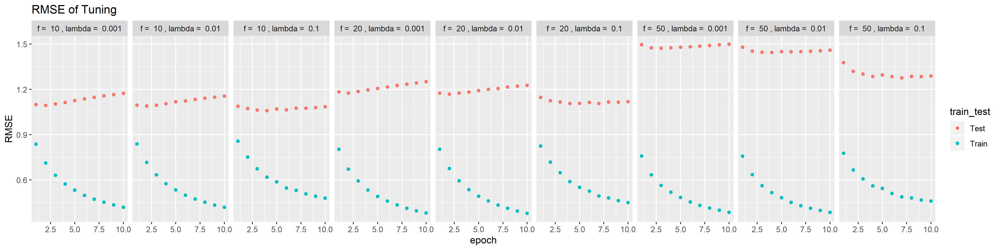

In this project, you are going to explore matrix factorization methods for recommender system. The goal is to match consumers with most appropriate products. Matrix factorization methods characterize both items and users by vectors of factors inferred from item rating patterns. High correspondence between item and user factors leads to a recommendation. Matrix factorization generally has 3 parts:

- factorization algorithm

- regularization

- postpocessing

It is highly recommended to read this [review paper](./paper/P1 Recommender-Systems.pdf).

### Step 1 Load Data and Train-test Split
```{r message=FALSE}
library(dplyr)
library(tidyr)
library(ggplot2)
library(anytime)
library(ggplot2)
data <- read.csv("../data/ml-latest-small/ratings.csv")
set.seed(0)

bins <- function(nbin, data=data){
  data$time <- anytime(data$timestamp) %>% format("%Y/%m/%d")
  time <- unique(data$time) %>% sort()
  bin_size <- round(length(time)/nbin)
  bin_label <- rep(1:nbin, each=bin_size)
  bin_label <- bin_label[1:length(time)]
  time_label <- data.frame(time, bin_label)
  time_label[is.na(time_label)] <- nbin
  bin <- merge(data, time_label, by="time") %>% select(-time)
  return(bin)
}

data_bins <- bins(30, data=data) 


test_idx <- sample(1:nrow(data), round(nrow(data)/5, 0))
train_idx <- setdiff(1:nrow(data), test_idx)
data_train <- data_bins[train_idx,]
data_test <- data_bins[test_idx,]
```

### Step 2 Matrix Factorization

#### Step 2.1 Algorithm and Regularization

- For algorithms, the referenced paper are:

A1. [Stochastic Gradient Descent](./paper/P1 Recommender-Systems.pdf) Section: Learning Algorithms-Stochastic Gradient Descent

- For regularizations, the referenced paper are:

R3. [Temporal Dynamics](./paper/P5 Collaborative Filtering with Temporal Dynamics.pdf) Section 4


```{r}
U <- length(unique(data_bins$userId))
I <- length(unique(data_bins$movieId))
source("../lib/Matrix_Factorization.R")
```


#### Step 2.2 Parameter Tuning

Here you should tune parameters, such as the dimension of factor and the penalty parameter $\lambda$ by cross-validation.

```{r}
source("../lib/cross_validation.R")
f_list <- c(10, 20, 50)
l_list <- seq(-3,-1,1)
f_l <- expand.grid(f_list, l_list)
```

```{r, eval=FALSE}
result_summary <- array(NA, dim = c(4, 10, nrow(f_l))) 
run_time <- system.time(for(i in 1:nrow(f_l)){
    par <- paste("f = ", f_l[i,1], ", lambda = ", 10^f_l[i,2])
    cat(par, "\n")
    current_result <- cv.function(data_bins, K = 3, f = f_l[i,1], lambda = 10^f_l[i,2])
    result_summary[,,i] <- matrix(unlist(current_result), ncol = 10, byrow = T) 
    print(result_summary)
  
})

save(result_summary, file = "../output/rmse.Rdata")
```

```{r}
load("../output/rmse.Rdata")
rmse <- data.frame(rbind(t(result_summary[1,,]), t(result_summary[2,,])), 
                   train_test = rep(c("Train", "Test"), each = 9), 
                   par = rep(paste("f = ", f_l[,1], ", lambda = ", 10^f_l[,2]), times = 2)) %>%           gather("epoch", "RMSE", -train_test, -par)
rmse$epoch <- as.numeric(gsub("X", "", rmse$epoch))
cv.result <- ggplot(rmse, aes(x = epoch, y = RMSE, col = train_test)) + geom_point() + 
  facet_grid(~par)
ggsave(plot=cv.result, filename = "cv_result.jpg",height = 100, width = 400, units="mm")
```



```{r}
load(file = "../output/mat_fac.RData")

RMSE <- data.frame(epochs = seq(10, 100, 10), 
                   Training_MSE = result$train_RMSE, 
                   Test_MSE = result$test_RMSE) %>% 
  gather(key = train_or_test, value = RMSE, -epochs)

ggplot(RMSE, aes(x = epochs, y = RMSE,col = train_or_test)) + 
  geom_point() + scale_x_discrete(limits = seq(10, 100, 10)) + 
  xlim(c(0, 100)) + 
  ggtitle("RMSE (f=10, lambda=0.1)")
```

### Step 3 Postprocessing
After matrix factorization, postporcessing will be performed to improve accuracy.
The referenced papers are:

P2:[Postprocessing SVD with KNN](./paper/P2 Improving regularized singular value decomposition for collaborative filtering .pdf) Section 3.5

P3:[Postprocessing SVD with kernel ridge regression](./paper/P2 Improving regularized singular value decomposition for collaborative filtering .pdf) Section 3.6

```{r, eval= FALSE}
result <- gradesc(f = 10, lambda = 0.1,lrate = 0.01, max.iter = 100, stopping.deriv = 0.01,
                   data = data_bins, train = data_train, test = data_test)

save(result, file = "../output/mat_fac.RData")
write.csv(result$p, file = "../output/p.csv")
write.csv(result$q, file = "../output/q.csv")
write.csv(result$b_user, file = "../output/b_user.csv")
write.csv(result$b_movie, file = "../output/b_movie.csv")
write.csv(result$b_bin, file = "../output/b_bin.csv")
write.csv(result$mu, file = "../output/mu.csv")

```


### Step 4 Evaluation
You should visualize training and testing RMSE by different dimension of factors and epochs ([One Epoch is when an ENTIRE dataset is passed forward and backward through the neural network only ONCE](https://towardsdatascience.com/epoch-vs-iterations-vs-batch-size-4dfb9c7ce9c9)). 


